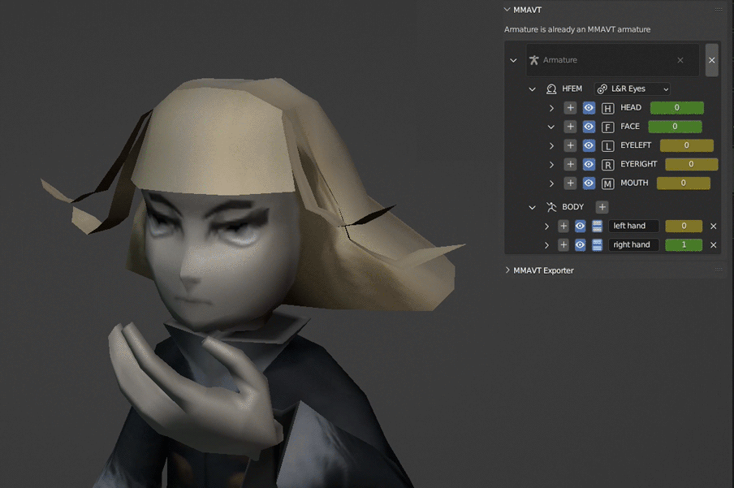

MMAVT is a system that allows low-poly animation methods like eye/mouth/hand meshswapping to be used easily in Blender and exported into engines like Unity.

# Install
Download repository as .zip file, go to Blender preferences -> Add-ons, click the "install" button in the upper right, and select the previously downloaded folder

# Links
Learn the basics of MMAVT [here](https://www.milancline.com/blog/archive/introducing-mmavt)  
Find an example implementation in Unity [here](https://github.com/Amiicli/MMAVT-Unity-Example)
